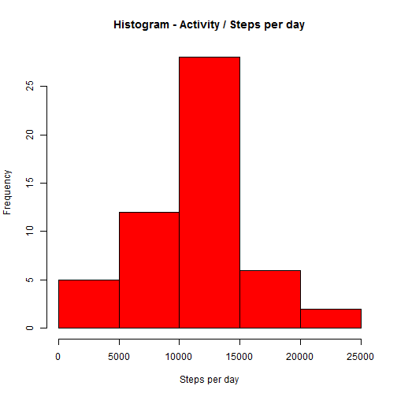
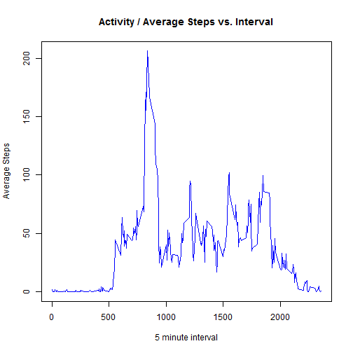
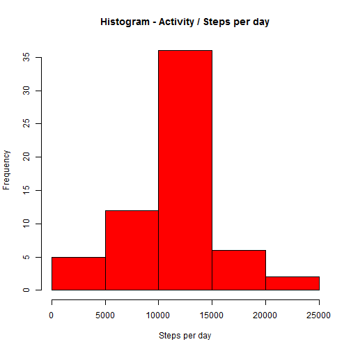

## Loading and preprocessing the data
The data is read into a CSV file.


```r
datadir="./data"
unzip("activity.zip", exdir=datadir)
```


```r
filelist <- list.files(datadir)
datafile <- filelist[1]
filepath <- paste(datadir,"/",datafile, sep="")
data <- read.csv(filepath, header=TRUE, stringsAsFactors=FALSE, na.strings="NA")
```

## What is mean total number of steps taken per day?

The data should be aggregated first in order to produce a histogram.
The code below aggregates the steps per day, by SUM function and plots the histogram.


```r
stepsperday <- aggregate(steps~date, data=data, sum, na.rm=TRUE)
hist(stepsperday$steps, 
     col="red", 
     xlab="Steps per day", 
     main="Histogram - Activity / Steps per day")
```

 

The code below calculates the mean and the median of the total number of steps taken each day.


```r
meansteps <- mean(stepsperday$steps)
mediansteps <- median(stepsperday$steps)
```

That is, on average 1.0766189 &times; 10<sup>4</sup> number of steps are taken each day. The median value is 10765.

## What is the average daily activity pattern?

This time we will need to aggregate the date over time intervals using 'mean' function.
The code below aggregates the data and plots the average steps taken w.r.t the time intervals.


```r
stepsperint <- aggregate(steps~interval, data=data, mean, na.rm=TRUE)
plot(stepsperint$interval, stepsperint$steps, 
     type="l",
     xlab="5 minute interval",
     ylab="Average Steps",
     main="Activity / Average Steps vs. Interval",
     col="blue")
```

 

We want to see at which time interval the activity in terms of average number of steps per day reaches to its maximum value.


```r
maxat <- stepsperint[which(stepsperint$steps==max(stepsperint$steps)),]
maxStepsAt <- maxat$interval
```

This time interval according to the calculation above is 835.


## Imputing missing values
Missing Values and NAs can be problematic in our data analysis tasks. We want to remove them.

Before any attempt to remove the missing values, it may be useful to see how many of them we have and in which columns.
  


```r
missingsteps <- nrow(filter(data, is.na(steps)))
missingdate <- nrow(filter(data, is.na(date)))                                                                                                 
missingint <- nrow(filter(data, is.na(interval)))
missingall <- nrow(filter(data, is.na(steps) | is.na(date) | is.na(interval)))
```

I have 2304 rows with NAs. This is not nice. 13% of my data!
I would like to replace NAs with the mean of the Steps.


```r
datafiltered <- filter(data, !is.na(steps))
impute.mean <- function(x)  {replace(x, is.na(x), mean(datafiltered$steps))}
data2 <- ddply(data, ~date, transform, steps = impute.mean(steps))
missingcheck <- nrow(filter(data2, is.na(steps)))        
```

Now I have new data with missing values replaced. I check this and really I have now 0 rows with NAs.

I can create another histogram and compare the values with the one above.


```r
newsteps <- aggregate(steps~date, data=data2, sum, na.rm=TRUE)
hist(newsteps$steps, 
     col="red", 
     xlab="Steps per day", 
     main="Histogram - Activity / Steps per day")
```

 

```r
meannew <- mean(newsteps$steps)
mediannew <- median(newsteps$steps)
```

I have now average 1.0766189 &times; 10<sup>4</sup> steps per day and the median value is 1.0766189 &times; 10<sup>4</sup>. 
Because I replaced the NAs with means, the median value became equal to the mean value, whereas it was slightly different before.
Remember median was 10765.


## Are there differences in activity patterns between weekdays and weekends?

We need to find out the days of the week from the given date column of the data. Then we will assign the weekends into 'weekend' and
the rest of the days to 'weekday'.


```r
Sys.setlocale('LC_TIME', 'C')
```

```
## [1] "C"
```

```r
wday <- as.factor(weekdays(as.POSIXlt(data2$date)))
data3 <- mutate(data2, weekday=wday)
days <- ifelse(data3$weekday %in% c("Saturday","Sunday"), "weekend", "weekday")
data3 <- mutate(data3, weekday=days)
```
  
Now using 'lattice' we will create a plot to visualize the difference in the patterns between weekdays and weekends.
The y-axis will be Number of steps.


```r
library(lattice)
weekavg <- ddply(data3, .(interval, weekday), summarise, steps=mean(steps))
xyplot(steps ~ interval | weekday, data = weekavg, 
       layout = c(1, 2), 
       type="l",
       xlab="Interval",
       ylab="Number of steps")
```

 
